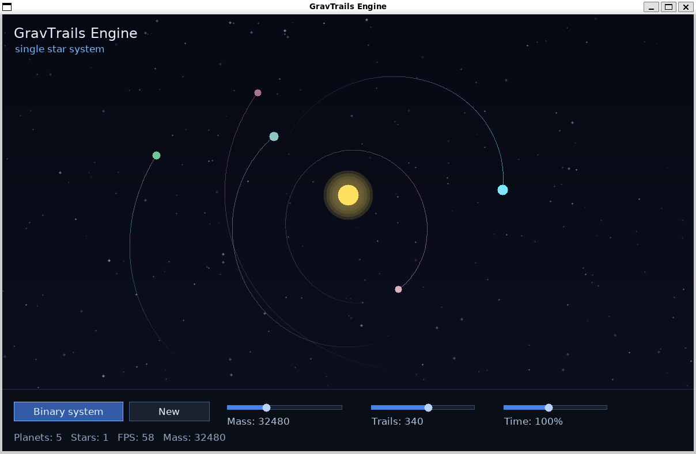
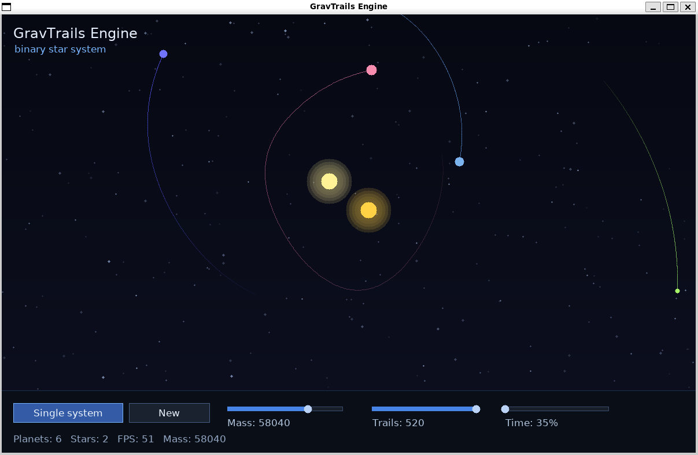

# GravTrails Engine

GravTrails Engine is a real-time interactive 2D gravity simulation app written in C++ using SDL2. It visualizes orbital motion with trails.

You can explore both single-star and binary-star systems, tweak parameters like mass and time scale, and generate new random planetary systems.

---

## Screenshots





---

## Features

- Real-time orbital gravity simulation  
- Single-star and binary-star modes  
- Interactive UI (buttons and sliders)  
- Smooth orbit trails  
- Random system generation  

---

## Tech Stack

- C++  
- SDL2  
- SDL_ttf  

---

## Controls

- Toggle between single and binary systems  
- Generate a new random system  
- Adjust mass, time scale, and trail length using sliders  

---

## Build & Run

Make sure you have SDL2 and SDL_ttf installed.

```bash
g++ main.cpp -o gravtrails -lSDL2 -lSDL2_ttf
./gravtrails
